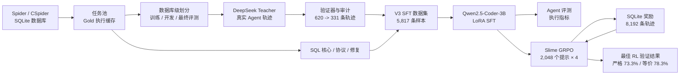

# SQLite-Agentic-RL

在可执行、可验证的 SQLite 环境中，用 SFT + GRPO 训练 3B 模型学习多轮工具调用。

> 这不是一个面向最终用户的 SQL 助手，而是一套可复现的 Agentic RL 工程实验：让模型在真实环境中完成 schema 探索、值探测、SQL 执行、结果验证与错误修正，并用环境反馈构造训练奖励。

`Qwen2.5-Coder-3B-Instruct` · `DeepSeek Teacher` · `LoRA SFT` · `Slime / Megatron / SGLang` · `GRPO` · `SQLite Verifier`

---

## 为什么做这个项目

Claude Code、Codex 等 API Agent 已能稳定调用工具完成复杂任务，但它们的工具使用训练过程通常不可见：模型如何学会选择工具、利用执行反馈、及时结束任务，以及如何通过强化学习进一步优化，都很难在闭源系统中直接复现。

SQLite 提供了一个成本较低但足够完整的研究环境：

- 状态真实：表结构、字段、外键、枚举值和查询结果都来自实际数据库；
- 动作明确：Agent 通过四个工具与环境交互；
- 反馈可执行：每条候选 SQL 都能直接运行；
- 奖励可验证：可以比较列、值、顺序、重复项和安全性；
- 轨迹足够长：模型需要探索 schema、定位 literal、执行 SQL，并根据错误继续修正。

因此，本项目用 SQLite 作为 Agentic RL 的 environment、verifier 与 reward sandbox，复现从真实 Teacher 轨迹、SFT 冷启动到 GRPO 在线训练的完整链路。

---

## 全链路



---

## 核心成果

| 模块 | 结果 |
|---|---:|
| 基座模型 | Qwen2.5-Coder-3B-Instruct |
| 正式 SFT 数据 | 5,817 条，纯 JSON Agent 协议 |
| 真实 Teacher 采集 | 620 条去重轨迹，筛出 331 条通过验证的轨迹 |
| SFT 完整开发集 | 300 个任务，严格或等价正确率 66.3%，SQL 可执行率 94.3% |
| 正式 RL 数据 | 2,048 个提示，10% 简单 / 45% 中等 / 45% 困难 |
| GRPO 采样规模 | 每组 4 条，共约 8,192 条轨迹 |
| 最佳 RL 验证结果 | 奖励 0.8163，严格正确率 73.3%，等价正确率 78.3% |
| Agent 稳定性 | 提交率 100%，可执行率 95%，协议有效率 100%，解析失败率 0% |

SFT 的 `full-dev` 与 GRPO 的 120-task validation 并非同一评测集合，不能直接视为严格的前后对比。GRPO 在同一份 RL validation 上，从 rollout 49 的 `strict 50.8% / equivalent 60.0%` 提升到 rollout 349 的 `strict 73.3% / equivalent 78.3%`。

可提交的结构化摘要位于 [`results/`](results/README.md)。当前数值由现有正式记录转录，并已核对对应 W&B run 身份；仓库尚未包含逐任务历史 rollout 或 W&B 原始 history，因此不能从这些摘要独立重算聚合指标。

---

## Agent 环境

### 四工具协议

Agent 只能通过以下工具读取数据库：

| 工具 | 作用 |
|---|---|
| `list_tables` | 获取数据库中的表名 |
| `get_schema` | 查询列、类型、主键和外键 |
| `preview_rows` | 仅在需要确认枚举值、文本值或日期格式时查看样例 |
| `execute_sql` | 执行单条只读 `SELECT` / `WITH` SQL |

模型每轮只能输出一个 JSON 对象。

```json
{"type":"tool_call","name":"get_schema","arguments":{"table_names":["orders","customers"]}}
```

当最后一次 SQL 已成功执行并足以回答问题时：

```json
{"type":"final","final_sql":"SELECT ...","answer":"..."}
```

`final_sql` 必须等于最后一次成功执行的 SQL，避免模型执行 A、提交未经验证的 B。

### 真实轨迹

正常 Agent 轨迹不是机械拼接的固定工具链。Teacher 在真实 SQLite 环境中自行决定：

```text
问题
-> list_tables / get_schema
-> 按需 preview_rows
-> execute_sql
-> 错误反馈 / 结果观察
-> 修复或结束
```

Teacher 冒烟测试还暴露了两类需要分离的问题：模型的字面值定位错误，
以及问题与 Gold SQL 本身不一致的可疑标签。项目通过严格验证器和 LLM
审计将它们分桶，避免把错标样本作为负向修复数据。

---

## 数据体系

### 正式 SFT

当前正式训练文件：

```text
data/sft/v3_real_json/sft_v3_real_json_5817.jsonl
```

| 类型 | 数量 | 作用 |
|---|---:|---|
| `teacher_agent` | 2,045 | 已有 Teacher Agent 轨迹 |
| `sql_core` | 1,100 | 稳定基础 SQL 能力 |
| `agent_trace` | 876 | 多轮工具使用行为 |
| `schema_only` | 714 | schema 理解与动作选择 |
| `protocol_anchor` | 500 | 固定标准 JSON 输出协议 |
| `repair_real` | 251 | 历史 Repair 来源；其中 142 条明确包含失败反馈 |
| `teacher_agent_real_v3` | 331 | DeepSeek V4 Pro 真实环境成功轨迹 |

全部模型监督目标已统一为 `json_v2`：

```text
assistant XML tags:       0
assistant schema errors:  0
invalid tool names:       0
```

### Teacher 数据来源

仓库只保留最小可追溯链：

```text
hard_train_pool_en_large_20260706.jsonl
-> hard_teacher_v4pro_en_all_dedup_20260706.jsonl     # 620
-> success=true 且 verifier 通过的轨迹              # 331
-> sft_v3_real_json_5817.jsonl                        # 5,817
```

331 条轨迹可使用
`sqlite_agent/scripts/sft/build_sft_from_teacher_rollouts.py` 和版本化
system prompt 重新转换；具体命令见
[`data/teacher_rollouts/README.md`](data/teacher_rollouts/README.md)。

### 数据划分

划分产物按完整 `db_id` 拆分训练、开发与最终评测，而不是随机拆问题；
Spider/CSpider 在进入任务池后按 `(db_id, normalized_gold_sql)` 去重。
这描述的是 split 文件的设计。历史 SFT 混合数据经历过多阶段迁移，现有
checkpoint 指标不作为严格未见 schema 泛化证据；边界说明见
[`数据管线`](docs/技术设计/数据管线.md)。

---

## SFT

正式 SFT 使用 Qwen2.5-Coder-3B-Instruct + LoRA：

```text
precision:              bf16
max_length:             2048
LoRA rank / alpha:      32 / 64
LoRA dropout:           0.05
micro batch:            1
gradient accumulation:  16
effective batch:        16
epochs:                 2
learning rate:          1e-4
scheduler:              cosine
gradient checkpointing: enabled
```

训练器在固定 optimizer step 保存 checkpoint，并在同一全局 step 轴记录训练和 Agent rollout 指标。正式选择的 `checkpoint-600` 在 300-task full-dev 上得到：

| 指标 | 结果 |
|---|---:|
| 严格或等价正确率 | 66.33% |
| 严格正确率 | 44.00% |
| 标准协议有效率 | 90.33% |
| 正常结束率 | 94.33% |
| SQL 可执行率 | 94.33% |
| 解析失败率 | 2.67% |
| 超出步数比例 | 3.00% |

主要剩余错误已经从协议失败转为“SQL 可以执行，但语义或结果错误”，适合作为 RL 阶段的优化对象。

---

## GRPO 与奖励

奖励由 SQLite 执行结果直接计算，正确性是主要信号，协议和轨迹行为作为
约束项。

| 条件 | 奖励 / 惩罚 |
|---|---:|
| 输出结果等价 | `+1.00` |
| SQL 可执行但结果错误 | `+0.20` |
| 已提交但不可执行 | `+0.05` |
| 解析失败 | `-0.30` |
| 协议无效 | `-0.20` |
| 超出步数预算 | `-0.10` |
| final 与最后成功执行 SQL 不同 | 正确项封顶 `0.80`，另扣 `-0.05` |
| 不安全 SQL | `-1.00` |
| 超过 6 次工具调用 | 每步 `-0.02` |

`final mismatch` 约束的是提交行为，不直接判断答案对错。verifier 始终重跑
final 中真正提交的 SQL：它本身正确但未匹配最后成功执行 SQL 时得到
`min(1.0, 0.80) - 0.05 = 0.75`。详细算例见
[`RL 与奖励设计`](docs/技术设计/RL与奖励设计.md#final-mismatch-与-075)。

正式 Stage 2 配置：

```text
train prompts:          2048
validation prompts:     120
group size:             4
planned trajectories:   8192
rollouts:               512
learning rate:          5e-7
KL coefficient:         0.002
KL type:                low_var_kl
actor / rollout GPUs:   2 / 2
tensor parallel:        2
optimizer CPU offload:  enabled
```

### 验证曲线

| 轨迹轮次 | 平均奖励 | 严格正确 | 结果等价 | 可执行 | 协议有效 | 超出步数 |
|---:|---:|---:|---:|---:|---:|---:|
| 49 | 0.6275 | 50.8% | 60.0% | 90.0% | 99.2% | 9.2% |
| 99 | 0.7196 | 62.5% | 70.0% | 95.0% | 100.0% | 4.2% |
| 199 | 0.7596 | 65.8% | 71.7% | 95.0% | 100.0% | 0.8% |
| 249 | 0.7846 | 66.7% | 75.0% | 95.8% | 100.0% | 0.8% |
| **349** | **0.8163** | **73.3%** | **78.3%** | **95.0%** | **100.0%** | **0.0%** |
| 499 | 0.7858 | 70.8% | 75.8% | 92.5% | 100.0% | 0.8% |

最佳验证点出现在 rollout 349；最终点仍优于早期验证，但已经出现小幅回落。

---

## 多卡训练工程

早期 3×32GB GPU 尝试在 Megatron logprob / entropy 路径发生 OOM，单纯把 rollout batch 从 2 降到 1 仍无法解决。最终配置采用：

- 4 GPU，Actor 与 Rollout 按 `2 + 2` 隔离；
- Tensor Parallel = 2；
- optimizer 全量 CPU offload；
- Flash Attention 与 activation recompute；
- dynamic batch + per-GPU token budget；
- SGLang rollout 与 Megatron actor 分离。

该配置完成全部 512 rollouts 和约 8,192 条 trajectories。工程重点不只是“调用 GRPO”，而是让长轨迹、多轮环境交互、参考 logprob 和多卡 rollout 在有限显存下稳定共存。

---

## 项目结构

```text
SQLite-Agentic-RL/
├── data/
│   ├── raw/                    # Spider/CSpider 原始任务与 SQLite 数据库
│   ├── pool/                   # 去重任务池与 Gold 执行缓存
│   ├── splits/                 # 数据库级训练/开发/最终评测划分
│   ├── sft/                    # 基础数据、正式训练集与审计信息
│   ├── eval/                   # mini / fast / full 三档 Agent 评测集
│   ├── teacher_rollouts/       # Teacher 候选池、真实轨迹与构造清单
│   └── rl/                     # RL smoke/repro 任务与构造清单
├── sqlite_agent/
│   ├── README.md               # 核心代码安装、结构与最短验证入口
│   ├── sqlite_agent_pkg/
│   │   ├── agent/              # JSON 协议与解析器
│   │   ├── compat/             # XML 输入兼容解析
│   │   ├── data/               # 任务数据结构
│   │   ├── env/                # SQLite 工具、SQL 安全检查、验证器
│   │   └── rl/                 # 奖励、Slime Agent、指标
│   └── scripts/
│       ├── data/               # 归一化、任务池、Gold 缓存、数据库划分
│       ├── env/                # 环境冒烟测试
│       ├── sft/                # 数据构造、Teacher rollout、SFT、评测
│       ├── rl/                 # RL 数据、LoRA 合并、Slime 启动器
│       └── archive/            # 复现实验与消融脚本
├── artifacts/                  # 权重交付说明；模型文件不进入 Git
├── results/                    # 可提交的 SFT / RL 结构化结果摘要
└── docs/
    ├── 技术设计/               # 系统事实、实现与证据边界
    ├── 项目演进/               # 关键技术路线和数据版本演进
    └── 面试笔记/               # 面试讲述与常见追问
```

---

## 快速开始

### 1. 基础环境与 SFT

当前正式运行验证过的基础环境：

```text
Python 3.12
CUDA 12.4
PyTorch 2.5.1
```

核心环境和测试可通过 `pyproject.toml` 安装；SFT 使用可选依赖。

```bash
cd SQLite-Agentic-RL
python -m pip install -e '.[dev]'
export PYTHONPATH="$PWD/sqlite_agent:${PYTHONPATH:-}"
```

需要运行 SFT 时使用：

```bash
python -m pip install -e '.[sft,data,dev]'
```

各阶段的完整命令不是集中堆在根 README 中：

- 数据下载、任务池、Gold 缓存与划分：[`sqlite_agent/scripts/data/README.md`](sqlite_agent/scripts/data/README.md)
- 正式 SFT 数据组成、Teacher 增量、训练与评测：[`sqlite_agent/scripts/sft/README.md`](sqlite_agent/scripts/sft/README.md)
- RL 数据、模型转换与 Slime GRPO：[`sqlite_agent/scripts/rl/README.md`](sqlite_agent/scripts/rl/README.md)

### 2. Slime RL 环境

GRPO 额外依赖 Slime、Megatron-LM、SGLang 和 Ray。Slime 官方建议优先使用预装兼容依赖的 Docker 镜像：

```bash
docker pull slimerl/slime:latest

docker run --rm --gpus all --ipc=host --shm-size=16g \
  --ulimit memlock=-1 --ulimit stack=67108864 \
  -v /host/path/SQLite-Agentic-RL:/workspace/SQLite-Agentic-RL \
  -v /host/path/models:/models \
  -it slimerl/slime:latest /bin/bash
```

本项目尚未在通用 Python extras 中锁定 Slime/Megatron/SGLang 的完整版本组合。当前安装、兼容性检查、HF→Megatron 转换和正式启动步骤见 [`RL 运行指南`](sqlite_agent/scripts/rl/README.md)。官方参考：[Quick Start](https://github.com/THUDM/slime/blob/main/docs/en/get_started/quick_start.md)、[Usage Guide](https://github.com/THUDM/slime/blob/main/docs/en/get_started/usage.md)。

### 3. 验证 SQLite 环境

```bash
python sqlite_agent/scripts/env/smoke_agent_env.py \
  --task-file data/splits/v2_db_seed42/dev_smoke.jsonl
```

该命令会检查 `list_tables`、`get_schema`、`preview_rows`、`execute_sql` 和 gold verifier。

### 4. 运行正式 SFT

```bash
BASE_MODEL=/path/to/Qwen2.5-Coder-3B-Instruct

python sqlite_agent/scripts/sft/run_formal_sft_eval.py \
  --model "$BASE_MODEL" \
  --train-data data/sft/v3_real_json/sft_v3_real_json_5817.jsonl \
  --mini-dev data/eval/mini_dev.jsonl \
  --fast-dev data/eval/fast_dev.jsonl \
  --full-dev data/eval/full_dev.jsonl \
  --output-dir checkpoints/qwen25_coder3b_sqlite_sft_v3_real_json_formal \
  --epochs 2 \
  --train-samples 5817 \
  --effective-batch-size 16 \
  --eval-every-steps 100 \
  --max-length 2048 \
  --learning-rate 1e-4 \
  --bf16 \
  --local-files-only \
  --wandb-project sqlite-agentic-rl-v2 \
  --wandb-run-name sft_v3_real_json_coder3b_formal
```

### 5. 单独评测 checkpoint

```bash
python sqlite_agent/scripts/sft/evaluate_sft_v2_agent.py \
  --base-model "$BASE_MODEL" \
  --adapter checkpoints/qwen25_coder3b_sqlite_sft_v3_real_json_formal/checkpoint-600 \
  --tasks data/eval/full_dev.jsonl \
  --output outputs/full_dev_checkpoint600.jsonl \
  --summary-output outputs/full_dev_checkpoint600.summary.json \
  --max-tool-steps 8 \
  --protocol json_v2 \
  --local-files-only
```

### 6. 构造正式 RL prompts

```bash
python sqlite_agent/scripts/rl/build_rl_smoke_tasks.py \
  --train-source data/splits/v2_db_seed42/train.jsonl \
  --val-source data/splits/v2_db_seed42/dev.jsonl \
  --output-dir data/rl/formal_stage2_2048 \
  --train-limit 2048 \
  --val-limit 120 \
  --seed 708 \
  --medium-ratio 0.45 \
  --hard-ratio 0.45 \
  --simple-ratio 0.10 \
  --max-empty-ratio 0.08
```

### 7. 启动 Slime GRPO

先将 SFT LoRA 合并为 Hugging Face 模型并转换为 Slime/Megatron checkpoint，随后在已配置的 Slime 环境中运行：

```bash
NUM_GPUS=4 \
ACTOR_GPUS=2 \
ROLLOUT_GPUS=2 \
TRAIN_TP_SIZE=2 \
SLIME_ROOT=/path/to/slime \
MEGATRON_ROOT=/path/to/Megatron-LM \
MERGED_HF=/path/to/qwen25-coder3b-sqlite-v3-merged-hf \
MEGATRON_CKPT=/path/to/qwen25-coder3b-sqlite-v3-torch-dist \
LOAD_CKPT=/path/to/qwen25-coder3b-sqlite-v3-torch-dist \
TRAIN_TASKS="$PWD/data/rl/formal_stage2_2048/train_tasks.jsonl" \
VAL_TASKS="$PWD/data/rl/formal_stage2_2048/val_tasks.jsonl" \
WORK_DIR="$PWD/outputs/rl/formal_stage2_2048/slime" \
OUTPUT_DIR="$PWD/checkpoints/slime_rl_stage2" \
NUM_ROLLOUT=512 \
ROLLOUT_BATCH_SIZE=4 \
N_SAMPLES_PER_PROMPT=4 \
EVAL_INTERVAL=50 \
SAVE_INTERVAL=511 \
MAX_TOOL_STEPS=6 \
ROLLOUT_MAX_RESPONSE_LEN=512 \
EVAL_MAX_RESPONSE_LEN=512 \
LR=5e-7 \
KL_LOSS_COEF=0.002 \
MAX_TOKENS_PER_GPU=3072 \
OPTIMIZER_CPU_OFFLOAD=1 \
WANDB_PROJECT=sqlite-agentic-rl-v2 \
bash sqlite_agent/scripts/rl/run_slime_rl_smoke.sh
```

模型合并、Megatron 转换路径和 Slime 根目录可通过 `MERGED_HF`、`MEGATRON_CKPT`、`LOAD_CKPT`、`SLIME_ROOT`、`MEGATRON_ROOT` 与 `PYTHON_BIN` 环境变量覆盖。

---

## 评测指标

| 指标 | 含义 |
|---|---|
| `strict_pass_rate` | 输出列与结果值均严格一致 |
| `equivalent_output_rate` | 结果值等价，允许列别名等非语义差异 |
| `pred_executable_rate` | 最终 SQL 可在目标 SQLite DB 执行 |
| `submitted_rate` | Agent 在步数预算内输出 final |
| `canonical_protocol_valid_rate` | 输出符合唯一 JSON schema |
| `parse_failed_rate` | 输出无法解析为合法 action/final |
| `budget_exceeded_rate` | 超过最大工具步数仍未完成 |
| `preview_usage_rate` | 使用样例值探测的任务比例 |

模型辅助 judge 只用于审计可疑标签，不替代 SQLite execution verifier 的主评测口径。

---

## 文档

[`docs/README.md`](docs/README.md) 将公开文档分成三组：

- `docs/技术设计/`：数据管线、SFT、Agent 运行时、RL 奖励与评测边界；
- `docs/项目演进/`：记录从 V1 到当前版本的关键技术路线；其中 [SFT 数据演进](docs/项目演进/SFT数据演进.md) 说明自动轨迹、Teacher、Repair、JSON V2 和最终 5,817 条数据；
- `docs/面试笔记/`：数据、SFT、Runtime、RL 四个模块的讲述和常见追问。

代码目录的文件职责和使用方式见 [`sqlite_agent/README.md`](sqlite_agent/README.md)，实验结果入口见 [`results/README.md`](results/README.md)。

---

## 当前限制

- 仓库不分发 Qwen 基座、SFT adapter 或 Slime/Megatron checkpoint；权重交付方式见 `artifacts/README.md`；
- RL 的 Slime / Megatron / SGLang 依赖未锁入通用 Python 环境，仍需按对应框架版本搭建训练镜像；
- 当前正式结果来自 Spider/CSpider 风格 SQLite 任务；划分文件按 DB 隔离，但历史训练数据来源使已发布指标不能作为严格未见 schema 泛化证明；
- SFT full-dev 与 RL validation 的任务集合不同，跨阶段指标仅用于观察能力水平，不作严格直接对比；
- 当前结果目录是正式记录的结构化转录，缺少逐任务历史 rollout 和 W&B 原始 history；
- 自动化测试覆盖协议、相对路径解析、SQLite 重复列结果读取和核心 reward；GPU 端到端训练仍依赖对应硬件环境验证。

---

## 项目定位

这个项目的重点不是证明“小模型已经替代闭源 Agent”，而是把 Agentic RL 中最关键、也最容易被 API 隐藏的部分做成一套可观察系统：

```text
state -> action -> tool execution -> observation -> verifier -> reward -> policy update
```

它展示了如何为工具型 Agent 构造真实轨迹、设计可执行奖励、处理 noisy label、组织多层评测，并在有限显存下跑通多卡在线 GRPO。
