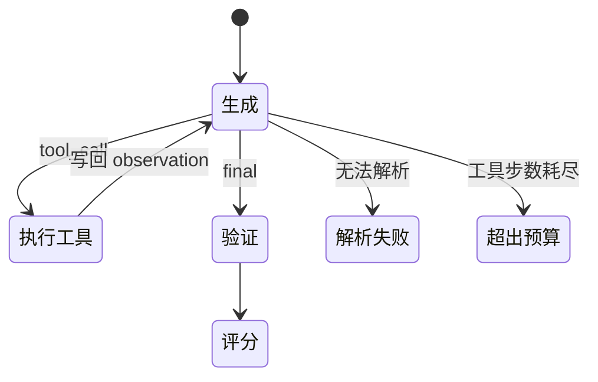

# Agent 运行时

## 分层

Agent Runtime 把模型文本变成环境动作，并维护多轮状态：

| 层 | 代码 | 职责 |
|---|---|---|
| 协议 | `agent/protocol.py` | 定义 tool/final JSON |
| 解析 | `agent/parser.py` | 解析输出并判断是否标准 |
| 环境 | `env/sqlite_tools.py`、`sql_guard.py` | 四工具、只读执行、结构化 observation |
| 循环 | `agent/rollout.py`、SFT/RL runtime | 更新 messages、步数和停止原因 |
| 验证 | `env/verifier.py` | 重跑最终 SQL 并比较完整结果 |

模型可调用 `list_tables`、`get_schema`、`preview_rows` 和 `execute_sql`。数据库使用只读 URI 打开，SQL guard 只允许单条 `SELECT`/`WITH`。

## 状态与停止条件

Runtime 记录 `last_successful_execute_sql`。协议要求 final 中的 `final_sql` 与它一致，但 verifier 始终重新执行真正提交的 `final_sql`，不会把最后成功执行的 SQL 偷换成评分答案。

## 结果读取与验证

模型看到的 observation 默认最多 100 行，`preview_rows` 最多 20 行；verifier 使用 `max_rows=None` 读取完整结果。SQLite 查询结果按列位置读取，因此即使 `SELECT 1 AS x, 2 AS x` 返回重复列名，也能保留 `[1, 2]`，不会因按名称索引而把第一列复制两次。

验证器提供两个主口径：

- strict：列名和值都一致；
- equivalent：列数和值一致，允许 alias 不同。

无顺序要求时使用多重集合比较，既忽略行顺序又保留重复项；有顺序要求时逐行比较。

## 三类运行链路

- Teacher：保存可审计 messages 和远端模型响应，用于筛选与蒸馏；
- SFT evaluator：加载本地模型/adapter，生成 checkpoint 级指标；
- Slime RL：异步调用 SGLang，并维护 token ids、logprobs 与 loss mask。

三者共享协议、工具和 verifier，但生成后端与输出对象不同。assistant 动作 token 的 `loss_mask=1`，环境 observation 的 `loss_mask=0`。
