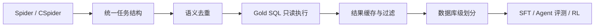

# 数据管线

## 设计目标

数据层负责把 Spider/CSpider 转成可执行、可验证、可追踪的 SQLite Agent 任务。核心不是格式转换，而是统一任务语义、预执行 Gold SQL、限制异常样本，并为 SFT、评测和 RL 提供明确来源。

统一任务包含 `task_id`、`db_id`、问题、Gold SQL、数据库路径、表名、完整 Gold Result 和答案约束。去重键为 `(db_id, normalized_gold_sql)`，用来合并 Spider/CSpider 中共享 SQL 的中英文问法。

## Gold 缓存与安全过滤

`cache_and_filter_task_pool.py` 在训练前执行 Gold SQL，缓存完整结果并过滤不可执行、过大或不安全样本。正式过滤约束包括：

| 约束 | 值 |
|---|---:|
| SQL 类型 | 单条只读 `SELECT` / `WITH` |
| 最大结果行数 | 500 |
| 最大 SQL 长度 | 1,200 字符 |
| 单条超时 | 5 秒 |

去重池共有 7,637 条；过滤后保留 7,586 条、206 个数据库。Gold 缓存保留完整结果，模型 observation 可以截断，两者用途不同。

## 数据划分

`data/splits/v2_db_seed42/` 按完整 `db_id` 生成 train、dev、final_eval 和 dev_smoke。划分文件本身保证 train/dev/final_eval 的数据库互斥：

| 划分 | 任务数 | 数据库数 |
|---|---:|---:|
| train | 6,069 | 134 |
| dev | 761 | 36 |
| final_eval | 756 | 36 |
| dev_smoke | 72 | 36 |

这项保证只描述划分产物。历史 SFT 混合数据由多个阶段演进而来，已发布的 checkpoint 指标不应被表述为“严格未见 schema 泛化结果”。当前指标适合证明工程链路和固定任务集上的训练变化；若要做严格泛化结论，需要从已审计的 train-only 数据重新训练，并只在从未用于构造、选模或调参的数据库上评测。

## 下游数据

- SFT：`data/sft/v3_real_json/sft_v3_real_json_5817.jsonl`
- Agent 评测：`data/eval/{mini_dev,fast_dev,full_dev}.jsonl`
- 可复现 RL 小规模数据：`data/rl/{train_tasks,val_tasks}.jsonl`
- 正式 Stage 2 的 2,048/120 任务在训练服务器构造，仓库记录构造命令和 W&B run，但未保留对应原始导出。

任何 Gold SQL/Gold Result 只能留在 metadata 或 reward label，不能渲染进模型 prompt。
