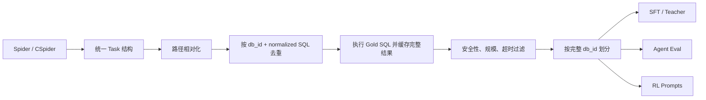

# 数据模块面试学习笔记

这套数据工程不是“把 Spider 转成 JSONL”这么简单。它要同时解决五个问题：统一中英文任务、保证 Gold 可执行、防止 schema 泄漏、构造高信息密度的 SFT 轨迹，并为 SFT 与 RL 保留相互独立的评测口径。

## 1. 数据链路总览



权威任务结构定义在 `sqlite_agent/sqlite_agent_pkg/data/task_schema.py`：

```text
task_id, db_id, question, gold_sql, db_path, table_names,
gold_result, answer_spec
```

`gold_result` 不是一段自然语言答案，而是 Gold SQL 的完整执行结果，包含列名、行值、顺序约束、重复项约束和哈希。后续 verifier 因此可以完全依赖环境执行，不需要让 LLM judge 决定 SQL 是否正确。

## 2. 原始数据为什么选 Spider 与 CSpider

项目使用 Spider 1.0 和 CSpider 1.0：

| 来源 | 任务规模 | 数据库数 | 语言 |
|---|---:|---:|---|
| Spider train | 7,000 | 140 | 英文 |
| CSpider train | 8,659 | 146 | 中文 |
| CSpider dev | 1,034 | 20 | 中文 |
| CSpider public test | 2,147 | 40 | 中文 |

CSpider 主要翻译问题文本，表名、列名和 SQL 仍为英文，因此两者存在大量共享数据库和共享 Gold SQL。不能简单拼接后随机切分，否则同一个 schema、甚至同一条 SQL 的中英文问法可能同时出现在 train 和 dev。

归一化由 `normalize_raw_datasets.py` 完成：读取 question、SQL、`tables.json` 和数据库目录，写成统一 JSONL；`relativize_paths.py` 再把机器绝对路径改为仓库相对路径，使数据能在本地、训练服务器和 CI 之间迁移。

## 3. 统一任务池如何构造

### 3.1 去重键

Spider/CSpider 合并后按下面的语义键去重：

```text
(db_id, normalized_gold_sql)
```

不能只按问题文本去重，因为中英文文本不同；也不能只按 SQL 去重，因为同一 SQL 在不同数据库中的语义不同。合并后保留英文、中文问题来源以及原始 task id，形成 paired、zh-only、en-only 三类任务。

过滤后的统一池共有 7,586 条、206 个数据库：

| 语言组 | 数量 |
|---|---:|
| 中英文配对 `paired_en_zh` | 2,759 |
| 仅中文 `zh_only` | 3,641 |
| 仅英文 `en_only` | 1,186 |

### 3.2 为什么预执行 Gold SQL

`cache_and_filter_task_pool.py` 在训练前实际执行每条 Gold SQL，缓存完整结果。这样有三点价值：

1. 提前发现数据库缺失、SQL 不兼容或标签不可执行；
2. RL 时无需反复执行 Gold，只重跑预测 SQL；
3. 可以控制超大结果、空结果和慢查询的占比，降低 reward 噪声。

正式过滤参数为：

| 约束 | 值 |
|---|---:|
| SQL 类型 | 单条只读 `SELECT` / `WITH` |
| 最大结果行数 | 500 |
| 最大 SQL 长度 | 1,200 字符 |
| 单条超时 | 5 秒 |

原始去重池 7,637 条，最终保留 7,586 条；丢弃 51 条，其中 48 条结果过大，3 条 Gold 执行失败。Gold 缓存使用完整结果，模型在 runtime 中看到的 observation 则会截断；两者不能混为一谈。

## 4. 为什么必须按数据库划分

项目以完整 `db_id` 为最小单元，将 206 个数据库按 seed 42 划分：

| 划分 | 任务数 | 数据库数 | 用途 |
|---|---:|---:|---|
| train | 6,069 | 134 | SFT、Teacher、RL 训练候选 |
| dev | 761 | 36 | checkpoint 选择与误差分析 |
| final_eval | 756 | 36 | 最终保留评测 |
| dev_smoke | 72 | 36 | 环境快速检查 |

核心约束是三个主划分之间没有数据库重叠。原因是 Text-to-SQL 模型很容易记住 schema 名、列名和常见 join 路径；如果只随机拆问题，即便问题不同，模型仍可能在验证集见过同一个数据库结构，指标会虚高。

`final_eval` 不用于超参数选择或 checkpoint 选择。训练期只使用 dev 派生出的评测集。

## 5. 三档 Agent 评测数据

| 文件 | 任务数 / DB | 设计目的 |
|---|---:|---|
| `mini_dev.jsonl` | 110 / 22 | 英文困难切片，用于低成本高频检查 |
| `fast_dev.jsonl` | 120 / 36 | 覆盖全部 dev DB，用于阶段性比较 |
| `full_dev.jsonl` | 300 / 36 | 正式 checkpoint 选择 |

`fast_dev` 是 `full_dev` 的子集，但并非无意义重复：前者降低频繁 rollout 的成本，后者降低小样本波动。`mini_dev` 则刻意偏向多表和复杂 SQL，用于尽早暴露 schema 探索与推理问题。

## 6. SFT 数据从哪里来

最终训练集不是单一 Teacher 生成，而是职责明确的混合数据：

| 类型 | 数量 | 学习目标 |
|---|---:|---|
| `sql_core` | 1,100 | 直接 SQL 基础能力 |
| `schema_only` | 714 | 根据问题和 schema 选择下一动作 |
| `protocol_anchor` | 500 | 固定 canonical JSON 输出 |
| `agent_trace` | 876 | 多轮工具调用与结束行为 |
| `repair_real` | 251 | 根据真实 SQLite 错误反馈修复 SQL |
| `teacher_agent` | 2,045 | 已有 Teacher Agent 行为 |
| `teacher_agent_real_v3` | 331 | 新采集、真实执行且 verifier 通过的轨迹 |
| **总计** | **5,817** | JSON V2 Agent 冷启动 |

这些类型的关键区别在于监督目标：`sql_core` 主要保住 SQL 生成能力；protocol anchor 让短小的协议 token 获得足够训练权重；Agent trace 教多轮决策；repair 强调“错误 observation → 修正动作”的因果关系。

### 6.1 5,486 条基础数据

V2 先将历史混合数据迁移为纯 JSON，过滤 14 条长度异常样本，得到 4,986 条清洗数据；再从 600 条候选中选取 500 条 protocol anchor，组成 5,486 条基础数据。

这一步主要解决协议冷启动，不重新调用 Teacher。最终审计结果为：assistant XML 标签 0、schema 错误 0、非法工具名 0。

### 6.2 331 条真实 Teacher 轨迹

Teacher 链路如下：

```text
train split
-> 1,000 条困难英文候选，92 DB，每 DB 最多 20 条
-> DeepSeek V4 Pro 在真实 SQLite runtime 自主调用工具
-> 620 条去重 rollout，覆盖 86 DB
-> verifier 成功 331 条，覆盖 81 DB
-> 转换为 SFT messages 并合入 5,486 条基础集
```

这里只保留成功轨迹进入正式 SFT。失败轨迹仍有错误分析价值，但不能因为“含有修复过程”就直接作为正向监督。转换时使用冻结的 `system_prompt_20260706.txt`，保证未来 prompt 变化不会让同一批原始 rollout 转出不同训练样本。

从方法上说，这是行为蒸馏：Teacher 提供状态—动作轨迹，3B Student 模仿其工具决策；SQLite verifier 充当质量门控，避免把 Teacher 错误无条件蒸馏进去。

## 7. Repair 数据主要修什么

`repair_real` 主要覆盖模型执行 SQL 后由 SQLite 暴露的错误，例如：

- 表名或列名不存在；
- join key、别名或作用域错误；
- SQLite 函数、语法或类型使用错误；
- literal 与库中真实值不一致；
- 查询可执行但 observation 表明结果不符合预期，于是继续探索和修改。

错误不是模型提前“自我判断”出来的，而是 runtime 执行工具后返回 `ok=false/error` 或结果 observation，模型再基于反馈决定修复。对于“SQL 可执行但语义错误”，模型在运行中未必知道，最终仍要由 verifier 比对 Gold Result。

早期机械 repair 会替换固定表名/列名或拼接模板，容易让模型记住“报错后再输出一次”的形式，而不是诊断真实 observation。正式数据因此更重视真实 student/teacher 执行失败形成的 transition。

## 8. 5,817 条是否太少

不能说“5,817 条足够训练通用 SQL 模型”。合理表述是：它足够承担一个窄领域 LoRA 冷启动实验，并且其有效监督量大于行数本身。

- 目标窄：训练的是固定四工具、固定 JSON 协议的 SQLite Agent；
- 每条多轮轨迹包含多个 assistant 监督位置，manifest 中共有 21,688 个 assistant target；
- 数据分工明确，避免同质化扩量；
- Teacher 样本经过真实执行和 verifier 筛选；
- 是否够用由独立 DB-level rollout 指标判断，不由行数自证；
- SFT 只负责建立可用策略，后续 RL 继续从在线环境反馈学习。

局限也必须承认：数据库和任务仍以 Spider/CSpider 为主，不能据此宣称能泛化到企业 SQL 方言、超大 schema 或长事务工作流。

## 9. 数据质量与泄漏边界

这个项目重点防的是 schema 级数据泄漏：train/dev/final_eval 按 DB 隔离。还要注意两条工程边界：

- Gold SQL、Gold Result 可以存在任务 metadata 和 reward label 中，但绝不能渲染到模型 prompt；
- 同一 SQL 的中英文问法先合并后再划分，避免平行语料跨集合。

数据审计至少同时看 manifest、JSONL 行数、路径可用性、Gold 可执行率、空结果比例、数据库交集和协议合法性。只看文件是否生成成功是不够的。

## 10. 面试表达

### 一分钟版本

> 我们先把 Spider 和 CSpider 归一化成统一 Task，按 `(db_id, normalized_gold_sql)` 合并中英文重复任务，再执行每条 Gold SQL 缓存完整结果，过滤不可执行、过大和超时样本。之后不是随机拆问题，而是按完整数据库划分 train/dev/final_eval，防止模型记住 schema 导致验证虚高。最终 SFT 有 5,817 条，由 SQL core、协议锚点、多轮轨迹、真实 repair 和 331 条 verifier 成功的 Teacher 轨迹组成。数据量不大，但目标窄、每条轨迹有多个监督位置，而且质量由真实执行和独立 Agent rollout 验证。

### 常见追问

**为什么不用 exact SQL string match？**

同一个查询语义可以有多种 SQL 写法。项目执行预测 SQL，严格指标比较列名与值，等价指标比较完整值结果并允许列别名不同。

**为什么失败 Teacher 轨迹不全部作为 repair？**

失败可能来自 Teacher 本身、标签噪声或问题与 Gold 不一致。没有审计就作为监督，会把错误行为蒸馏给 Student。

**最大的剩余数据风险是什么？**

Spider/CSpider 的任务分布和 schema 规模有限；空结果、可疑 Gold、平行问法以及 metadata 到 prompt 的意外泄漏都需要持续审计。
