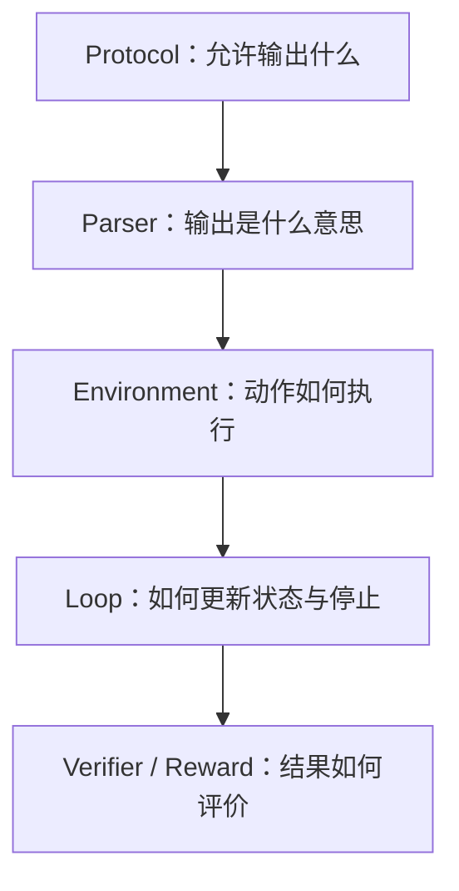
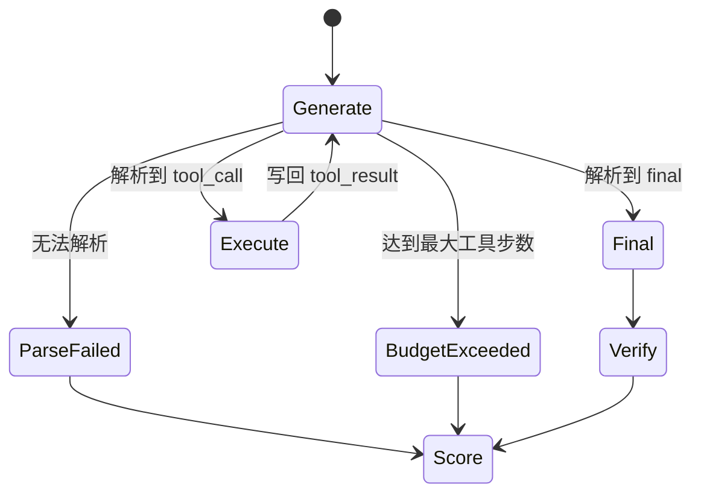

# Agent 运行时模块面试学习笔记

Agent Runtime 是模型与 SQLite 环境之间的控制层。它把“模型生成文本”变成可执行动作，把数据库结果变成下一轮 observation，并决定何时结束、如何记录错误、最终用哪条 SQL 评分。

项目中所谓的 “Agent time” 实际应称为 **Agent Runtime**。

## 1. Runtime 解决什么问题

普通 Text-to-SQL 是一次映射：

```text
question + schema -> SQL
```

Agentic Text-to-SQL 是一个闭环：

```text
question
-> model action
-> parser
-> SQLite tool
-> observation
-> model action
-> ...
-> final_sql
-> verifier
```

Runtime 负责五件事：

1. 定义合法动作空间；
2. 解析和规范模型输出；
3. 安全执行工具；
4. 保存轨迹状态和停止原因；
5. 把最终提交交给 verifier/reward。

## 2. 四层结构



| 层 | 代码 | 核心职责 |
|---|---|---|
| Protocol | `agent/protocol.py` | system prompt、tool/final JSON schema |
| Parser | `agent/parser.py` | 解析 action/final，判断 canonical |
| Environment | `env/sqlite_tools.py`、`sql_guard.py` | 四工具、只读执行和 observation |
| Loop | `agent/rollout.py`、各评测/RL runtime | 维护 messages、步数、最后成功 SQL |
| Verifier | `env/verifier.py` | 重新执行最终 SQL并比较完整结果 |

## 3. 动作协议

模型每轮只能输出一个 JSON 对象。工具调用：

```json
{"type":"tool_call","name":"get_schema","arguments":{"table_names":["orders","customers"]}}
```

结束动作：

```json
{"type":"final","final_sql":"SELECT ...","answer":"..."}
```

四个可见工具：

| 工具 | 使用场景 |
|---|---|
| `list_tables` | 不知道数据库有哪些表时建立全局视图 |
| `get_schema` | 获取相关表的列、类型、主键和外键 |
| `preview_rows` | 确认枚举值、literal、文本大小写或日期格式 |
| `execute_sql` | 执行候选查询并观察结果或错误 |

`sql_guard` 不是模型工具。它在环境侧强制 SQL 为单条只读 `SELECT`/`WITH`，拒绝 `DROP`、`UPDATE`、`PRAGMA` 等危险关键字。

## 4. “可解析”与“协议标准”为什么分开

Parser 返回 `(parsed_object, canonical)`。例如模型输出：

```text
Here is the action: {"type":"tool_call",...}
```

首个 JSON 可能仍可提取，Runtime 可以继续执行，但 `canonical=false`。这样既避免一次多余前缀让整条昂贵 rollout 立即报废，又能通过指标或惩罚持续约束模型回到唯一 schema。

正式 canonical 条件包括：

- 整轮只有一个 JSON 对象，无额外文本；
- tool call 恰好包含 `type/name/arguments`；
- final 恰好包含 `type/final_sql/answer`；
- 工具名属于四个白名单；
- arguments 为对象。

历史 XML 兼容 parser 位于 `compat/xml_v1.py`，只服务于旧数据迁移，不进入正式 Runtime。

## 5. 一条轨迹如何运行

Runtime 的核心状态可以表示为：

```text
messages
actions
tool_steps
last_successful_execute_sql
final_sql
parse_failed / budget_exceeded / protocol flags
```

状态机如下：



每次 `execute_sql` 成功后，Runtime 更新 `last_successful_execute_sql`。final 阶段要求 `final_sql` 与它相同，避免“执行 A 验证成功，却提交未经执行的 B”。

## 6. SQLite observation 的设计

环境连接使用 SQLite URI 的 `mode=ro`。四工具返回结构化字典，失败不会抛到模型进程外，而是变成：

```json
{"type":"tool_result","result":{"ok":false,"error":"no such column: ..."}}
```

这使 SQL 执行失败成为可学习状态，而不是整条任务崩溃。

展示给模型的结果需要限制体积：

- `preview_rows` 最多 20 行；
- 通用 `execute_sql` observation 默认最多 100 行；
- RL runtime 还会进一步压缩成功执行结果，避免长结果占满上下文。

但最终 verifier 使用 `max_rows=None` 重新执行 `final_sql`，比较完整结果。也就是说，observation 截断只影响模型能看到多少，不会降低评分严谨性。

## 7. 最终结果如何验证

`verify_sql()` 先安全执行预测 SQL，再根据 Gold Result 比较：

- `header_exact`：列名相同且结果值相同；
- `value_exact`：列数量相同、值相同，允许 alias 差异；
- 无顺序要求时使用 `Counter(rows)`，因此对顺序不敏感、对重复项敏感；
- 有顺序要求时逐行比较。

这比 SQL 字符串 exact match 更合理，因为 join 顺序、子查询写法、alias 和等价谓词都可能不同，但执行语义一致。

## 8. 三条 Runtime 链路有什么不同

项目有三类 loop，它们共享协议、工具和 verifier，但面向不同后端与输出对象。

### 8.1 通用同步 / Teacher 链路

核心是 `agent/rollout.py`：调用方提供 `generate(messages) -> text`，它负责 parse、execute、append observation 和 stop。

Teacher collector 在此语义上增加远端 API 调用、重试、耗时和原始响应记录。目标输出是可审计的自然 messages/trajectory，之后用于数据筛选和 SFT。

### 8.2 SFT checkpoint 评测链路

`evaluate_sft_v2_agent.py` 自己管理 Hugging Face tokenizer/model generation，并记录 checkpoint 比较所需的细粒度指标。它需要处理本地 adapter、生成停止、批次与结果文件，所以没有直接套用最小同步 helper。

目标不是产生训练 token，而是回答：“这个 checkpoint 在固定任务上协议、执行和结果表现如何？”

### 8.3 RL 链路

RL 又有两个运行形态：

- `run_rl_dryrun_hf.py`：单机 Hugging Face 仿真，用于上线前检查 reward、轨迹和组内奖励方差；
- `rl/slime_agent.py`：生产异步 Runtime，通过 SGLang HTTP 采样，并维护 token ids、logprobs 和 loss mask，返回 Slime `Sample`。

Slime 版本必须区分可训练 token 与环境 token：assistant action 为 `loss_mask=1`，tool observation 为 `loss_mask=0`。这是通用 rollout helper 不需要处理的训练接口。

## 9. 三条链路是否冗余

没有一条在职责上完全多余：Teacher 要保存可蒸馏 messages，SFT evaluator 要加载 LoRA 并产出 checkpoint 指标，Slime Runtime 要维护异步采样和 token 级训练元数据。

确实存在有意的 loop 代码重复，例如 parse → execute → append observation。当前规模下，共享 protocol、tool、verifier 已经消除了最危险的语义分叉；强行把所有后端塞进一个巨型 loop，反而会增加回调和状态适配复杂度。

更准确的工程判断是：

- **不冗余的部分**：生成后端、输出对象、token/loss mask、API 重试和评测记录；
- **可继续抽象的部分**：统一 trajectory state、停止原因、`last_successful_execute_sql` 和 observation compaction；
- **抽象前提**：需要测试保证 Teacher、HF dry-run 和 Slime 对同一模型输出得到相同状态转移。

## 10. 不同错误发生后会怎样

| 错误 | Runtime 行为 | 后续信号 |
|---|---|---|
| JSON 无法解析 | 结束轨迹，标记 `parse_failed` | RL 负奖励；SFT 评测计失败 |
| 工具名/参数错误 | parser 拒绝或工具返回错误 observation | 模型可能修复；协议指标下降 |
| SQL 语法/列名错误 | `execute_sql` 返回 `ok=false/error` | 模型获得下一轮修复机会 |
| SQL 可执行但结果错误 | Runtime 本身不知道语义错 | final verifier 与 Gold Result 比较 |
| 危险 SQL | guard 拒绝，数据库仍只读 | reward 直接 `-1` |
| 超出步数 | 结束轨迹，`budget_exceeded=true` | 负奖励并计入评测 |
| final 与最后成功 SQL 不同 | 仍重新执行并验证提交的 final | 正确项封顶 0.80，再扣 0.05；记录 mismatch |

这里最重要的区分是：SQLite 能发现“执行错误”，但不能单独发现“执行成功、语义错误”。后者必须由 verifier 使用 Gold Result 判断。

`final mismatch` 不是“最终答案一定错”。它只表示模型最后提交的 SQL，和轨迹中最后一次成功执行的 SQL 不同。例如执行 A 后提交 B，或者没成功执行任何 SQL 就直接提交 B。verifier 只按 B 的完整执行结果判断正确性：B 正确但 mismatch 时是 `min(1.0, 0.80) - 0.05 = 0.75`；B 可执行但错误时是 `0.20 - 0.05 = 0.15`。这个信号约束的是“先执行确认，再原样提交”的行为一致性，不会拿 A 的正确性替 B 得分。

## 11. Runtime 与训练的关系

SFT 看到的是离线固定轨迹；Runtime 评测会让模型进入自身生成导致的状态分布。RL 更进一步：Runtime 在线采样多条轨迹，将最终环境结果变成 reward，再更新 policy。

因此 Runtime 不是推理期附属脚本，而是 Agentic RL 的环境接口：协议定义 action space，工具定义 transition，messages 构成 state，verifier/reward 定义 objective。

## 12. 面试表达

### 一分钟版本

> Agent Runtime 是模型和 SQLite 之间的状态机。模型每轮输出一个 JSON action，parser 区分可解析与 canonical 协议，环境只读执行四个工具并把结果或错误写回 observation；成功执行 SQL 后记录 last successful SQL，final 必须提交同一条。最终 verifier 会在完整结果上重跑 SQL，而不是相信模型看到的截断 observation。项目有 Teacher、SFT 评测和 Slime RL 三类 loop，它们共享协议、工具和 verifier，但生成后端、记录格式以及 token/loss mask 职责不同，因此不是完全冗余。

### 常见追问

**模型怎么知道 SQL 错了？**

语法、表列名等执行错误由 SQLite 返回 error observation，模型可以继续修复；可执行但语义错误通常要到最终 verifier 才能知道。

**为什么 observation 不参与 loss？**

它是环境给出的状态，不是策略选择的动作。把 observation token 设为 `loss_mask=0`，只优化 assistant 生成的 action/final。

**为什么 final 还要再执行一次？**

模型可能提交未执行的 SQL，且之前 observation 可能被截断。重新执行完整 final 才能保证 reward 对应真实提交结果。
