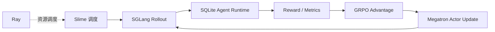

# RL 模块面试学习笔记

RL 阶段的目标不是重新教模型 JSON 格式，而是在 SFT 已具备稳定协议和较高可执行率之后，用真实 SQLite 执行反馈继续优化结果正确性、探索效率、错误恢复和及时结束。

## 1. 为什么 SFT 后还需要 RL

SFT 只能模仿已有轨迹。训练时每一步都处在数据给定的正确历史中，无法完全覆盖模型自身错误造成的新状态。RL 则让当前 policy 在线与环境交互：

```text
当前模型
-> 同一问题采样 4 条不同轨迹
-> SQLite 执行动作与最终 SQL
-> verifier 给每条轨迹打分
-> 组内比较得到相对优势
-> 更新模型
```

SFT checkpoint-600 已达到 94.33% 可执行率，说明 action space 基本稳定；剩余错误主要是可执行但结果错误，适合用执行奖励继续区分。

## 2. Slime 框架在项目中的角色

本项目的 RL 栈不是单一库：

| 组件 | 职责 |
|---|---|
| Slime | 编排训练、rollout、数据与自定义 Agent/reward hook |
| Ray | 启动作业并调度分布式进程和 GPU 资源 |
| SGLang | 高吞吐在线推理，生成多轮 rollout |
| Megatron | Actor 训练、logprob、优化器和 checkpoint |
| SQLite Runtime | 工具执行、状态转移和安全边界 |
| Verifier/Reward | 完整结果验证并生成标量奖励 |



自定义入口由 `run_slime_rl_smoke.sh` 传给 Slime：

```text
custom generate: sqlite_agent_pkg.rl.slime_agent.generate
custom reward:   sqlite_agent_pkg.rl.slime_agent.reward_func
rollout metrics: sqlite_agent_pkg.rl.slime_metrics
```

## 3. RL 数据如何进入 Slime

`prepare_slime_data.py` 为每个任务生成：

```text
prompt:       system prompt + user question
reward_model: Gold 与任务字段的 JSON label
metadata:     db_path、db_id、question、gold_sql、gold_result
```

关键隔离是：Gold SQL 与 Gold Result 存在 reward label/metadata 中，但 `render_prompt()` 只渲染 system prompt 和问题。它们供环境评分使用，不能进入模型可见上下文，否则 RL 会退化成答案泄漏。

仓库内 `data/rl/` 的 768 train / 60 val 是 smoke/repro 数据。正式 Stage 2 另行从 train/dev 构造 2,048 / 120：

| 配置 | 值 |
|---|---:|
| seed | 708 |
| train prompts | 2,048 |
| validation prompts | 120 |
| simple / medium / hard | 10% / 45% / 45% |
| 最大空 Gold 比例 | 8% |

## 4. Slime Agent 如何生成一条训练轨迹

`slime_agent.generate()` 的核心过程：

1. 从 sample 读取 prompt 和 metadata；
2. 调用 SGLang HTTP 接口生成首个 action JSON；
3. parser 判断 final 或 tool call；
4. 对 tool call 执行 SQLite 工具，把 observation 追加到上下文；
5. 重复直到 final、解析失败或达到最大工具步数；
6. 对提交的 `final_sql` 重新执行完整 verifier；
7. 写入 reward、指标、token ids、logprobs 和 loss mask。

训练 mask 非常关键：

```text
prompt token:        loss_mask = 0
assistant action:    loss_mask = 1
tool observation:    loss_mask = 0
assistant next step: loss_mask = 1
```

策略只为自己选择的 token 负责，不学习复现环境返回的数据库内容。

## 5. Reward 在哪里计算

真正的评分逻辑位于 `sqlite_agent_pkg/rl/reward.py` 的 `compute_sqlite_agent_reward()`。Slime Agent 在一条轨迹结束时调用它，并把完整指标放入 sample metadata；Slime 随后调用 `reward_func()` 读取预计算 reward。

这样 reward 计算发生在掌握完整轨迹状态的 Runtime 内，能够使用：

- `final_sql`；
- 最后一次成功执行的 SQL；
- parse/protocol/budget 状态；
- 工具步数；
- db_path 与 Gold Result。

## 6. Reward 公式

总奖励由 outcome 与 penalty 相加：

```text
R = R_outcome + P_parse + P_budget + P_protocol
    + P_finalization + P_steps
```

不安全 SQL 是特殊硬分支，最终直接返回 `-1.0`。

### 6.1 结果奖励

| 最终结果 | `R_outcome` |
|---|---:|
| 完整结果值等价 | `+1.00` |
| SQL 可执行但结果错误 | `+0.20` |
| 已提交但不可执行 | `+0.05` |
| 没有 final | `0`，只保留 penalty |

结果等价通过重新执行 `final_sql` 得到，要求列数一致、完整值相同，并遵守顺序/重复项约束。列 alias 不同不影响 equivalent；列名也相同才计 strict。strict 是监控指标，不另加奖励。

### 6.2 约束惩罚

| 条件 | 惩罚 |
|---|---:|
| parse failed | `-0.30` |
| budget exceeded | `-0.10` |
| protocol invalid | `-0.20` |
| 可解析但非 canonical | `-0.05` |
| final 不等于最后成功执行 SQL | `-0.05` |
| 超过 6 次工具调用 | 每多一步 `-0.02` |
| 不安全 SQL | 最终 reward 直接为 `-1.00` |

### 6.3 具体算例

| 轨迹 | 计算 | 最终奖励 |
|---|---|---:|
| canonical、6 步内、结果等价、final 匹配 | `1.00` | `1.00` |
| canonical、结果错误但 SQL 可执行 | `0.20` | `0.20` |
| final 自身结果等价，但未匹配最后成功 SQL | `min(1,.80) - .05` | `0.75` |
| 结果等价、用了 8 个工具步骤 | `1.00 - 2×.02` | `0.96` |
| 解析失败且没有 final | `0 - .30 - .20 - .05`，具体还取决于传入 flags | 负值 |
| 提交 `DROP TABLE` | 硬分支 | `-1.00` |

第三个例子中，verifier 重新执行的是 final 里真正提交的 SQL；它本身结果正确，所以保留大部分正确性奖励。mismatch 只说明这条 SQL 没有经过上一轮成功执行确认，因此正确项先封顶 0.80，再扣 0.05，得到 0.75。这是行为一致性的软约束，不是用“上一条正确 SQL”替 final 得分。

## 7. 为什么 outcome 要占主导

如果给“用了正确工具”“输出协议漂亮”很高正奖励，模型可能学会形式正确但不解决问题。当前 reward 只给结果正确 `+1`，可执行错误只给 `+0.2`，协议主要采用惩罚，因此优化方向以任务结果为主。

`+0.20` 和 `+0.05` 是稠密的早期信号：完全不给部分奖励时，大多数困难轨迹可能同为 0，GRPO 组内没有有效方差；但部分奖励不能过高，否则会产生“提交任意可执行 SQL”的捷径。

## 8. GRPO 如何使用这些奖励

同一 prompt 采样 group size 4。简化理解，先在组内标准化 reward：

```math
A_i = \frac{R_i - \operatorname{mean}(R_1,\dots,R_4)}
{\operatorname{std}(R_1,\dots,R_4)+\epsilon}
```

高于同组平均的轨迹获得正优势，低于平均的获得负优势。策略更新使用 PPO 风格 clipped objective，并加入与参考策略的 KL 约束。

这带来两个实际结论：

- 如果四条轨迹奖励完全相同，组内优势接近 0，几乎没有学习信号；
- reward 的相对排序通常比绝对尺度更关键，但错误的 proxy 排序仍会被放大。

项目的 HF dry-run 会检查 group 内 reward variance，确认模型对同一问题能采样出不同质量的轨迹，再启动昂贵的分布式训练。

## 9. Reward hacking 是什么

Reward hacking 不是“模型写出了与 Gold SQL 不同但结果等价的 SQL”。后者是我们希望得到的合法泛化。Reward hacking 指模型利用奖励代理的漏洞，在没有真正完成任务时获得高分。

### 9.1 威胁模型与当前防护

| 可能的捷径 | 当前防护 | 残余风险 / 可加强方向 |
|---|---|---|
| 始终提交 `SELECT 1` 获取可执行奖励 | 正确为 `1.0`，错误可执行仅 `0.2`；同时监控 equivalent | **仍是残余风险。** 若早期组内大多错误，`.2` 可能成为局部策略；可退火部分奖励或仅对“接近正确”给 shaping |
| 只刷 canonical JSON 和工具调用 | 协议没有独立大额正奖励，主要是惩罚 | 监控 protocol 已满但 equivalent 不升；避免把过程指标当主 reward |
| 执行一条 SQL，再提交未经确认的另一条 | 记录 last successful SQL；reward 重新执行真正提交的 final | final 自身正确但 mismatch 仍有 `.75`，属于软约束；若更重视流程一致性可改成硬匹配 |
| 用写操作改数据库制造答案 | `mode=ro` 连接、SQL guard、危险 SQL `-1` | 关键词 guard 不是完整 SQL parser；高安全场景可加 SQLite authorizer/隔离副本 |
| 无限调用工具等待偶然成功 | 最大步数；6 步后每步 `-.02` | 工具成本是线性软惩罚；可按工具成本差异化收费 |
| 利用 observation 截断伪造局部匹配 | verifier 重跑 final，使用完整结果 `max_rows=None` | 上下文截断仍可能影响求解，但不能直接骗过 verifier |
| 用列 alias 绕过 strict | equivalent 有意允许 alias，但 strict 独立监控 | 这是设计允许的语义等价，不是 hacking；若输出 schema 本身有业务意义，应提高 strict 权重 |
| 通过空结果任务输出恒为空查询 | 正式构造限制空 Gold 比例，当前 smoke 空结果为 0 | 空结果仍是 benchmark shortcut；应分桶报告并增加非空难例 |
| 从 metadata 直接读取 Gold | Gold 不渲染进 prompt，只在环境/reward 侧 | 必须测试数据加载和日志模板，防止未来 refactor 把 metadata 拼进 prompt |
| 生成额外文本，依赖 parser 只取第一个 JSON | 首个 JSON 可执行但标记非 canonical并惩罚 | parser 宽容度是可用性与规范性的折中；可在训练后期改为严格拒绝 |

### 9.2 如何发现 reward hacking

不能只看平均 reward。项目同时记录：

```text
strict / equivalent / submitted / executable
protocol / canonical / parse_failed / budget_exceeded
avg_tool_steps / final_matches_last_execute
```

典型报警模式：

- reward 上升，但 equivalent 不升：可能在刷部分奖励或 penalty；
- executable 接近 100%，equivalent 停滞：可能出现 `SELECT 1` 一类捷径；
- protocol 100%，结果不升：模型只优化格式；
- tool steps 快速下降、正确率也下降：过强效率惩罚导致过早 final；
- validation reward 上升但 strict/非空难例下降：可能利用评测分布特征。

因此 checkpoint 依据固定 validation 的多指标联合选择，而不是取训练 reward 最大值或最后一步。

### 9.3 Reward 设计仍可怎样增强

在继续扩大实验前，可以做以下消融：

1. 将“可执行但错误”的 `+0.2` 随训练退火到 0；
2. final mismatch 时把正确奖励从 0.75 改为 0 或更低；
3. 按空/非空、SQL 难度、工具长度分别报告验证指标；
4. 使用 SQL parser/SQLite authorizer 加强安全边界；
5. 对真实执行错误后的成功修复单独记录 recovery bonus，但避免奖励无意义的故意犯错；
6. 用 held-out 数据库和对抗任务检查 proxy 是否泛化。

“修复奖励”尤其要谨慎：如果只要先失败再成功就加分，模型会故意制造错误来赚 bonus。更安全的做法是把 recovery 当指标，或对同样正确结果优先奖励更短且无故障的轨迹。

## 10. 正式训练参数

| 参数 | 值 |
|---|---:|
| 算法 | GRPO |
| train / validation prompts | 2,048 / 120 |
| group size | 4 |
| 计划轨迹数 | 约 8,192 |
| rollout 次数 | 512 |
| rollout batch size | 4 |
| learning rate | `5e-7` |
| KL coefficient | `0.002` |
| KL type | `low_var_kl` |
| PPO clip / high clip | `0.20 / 0.28` |
| 最大工具步数 | 6 |
| 单轮最大 response | 512 tokens |
| actor / rollout GPU | 2 / 2 |
| tensor parallel | 2 |
| per-GPU token budget | 3,072 |
| optimizer CPU offload | enabled |

`group size=4` 是样本效率与显存/推理成本的折中。`KL=0.002` 约束 policy 不要快速偏离 SFT/reference；学习率 `5e-7` 远小于 SFT 的 `1e-4`，因为在线策略更新噪声更大。

## 11. 多卡工程问题

早期 3×32GB 配置在 Megatron 的 logprob/entropy 路径 OOM。把 rollout batch 从 2 降到 1 仍没有根治，因为显存瓶颈不只来自 SGLang rollout，还来自 actor/ref logprob、长序列激活和优化器状态。

最终方案：

- 4 GPU，Actor 与 Rollout 按 2+2 隔离；
- TP=2；
- optimizer 全量 CPU offload；
- activation recompute 与 Flash Attention；
- dynamic batching 和每卡 3,072 token budget；
- SGLang 与 Megatron 分离，减少资源竞争。

这里 Ray 的作用是启动和调度这些分布式角色，不负责 RL 数学本身；Slime 负责把它们编排成训练闭环。

## 12. 最终结果如何解释

固定 120-task RL validation 的曲线：

| Rollout | Avg reward | Strict | Equivalent | Executable | Protocol | Budget exceeded |
|---:|---:|---:|---:|---:|---:|---:|
| 49 | 0.6275 | 50.8% | 60.0% | 90.0% | 99.2% | 9.2% |
| 99 | 0.7196 | 62.5% | 70.0% | 95.0% | 100.0% | 4.2% |
| 199 | 0.7596 | 65.8% | 71.7% | 95.0% | 100.0% | 0.8% |
| 249 | 0.7846 | 66.7% | 75.0% | 95.8% | 100.0% | 0.8% |
| **349** | **0.8163** | **73.3%** | **78.3%** | **95.0%** | **100.0%** | **0.0%** |
| 499 | 0.7858 | 70.8% | 75.8% | 92.5% | 100.0% | 0.8% |

最佳点是 rollout 349，而不是最终 rollout 499。后期小幅回落说明在线 RL 同样需要 early stopping/checkpoint selection。

可靠结论是：在同一 RL validation 上，49 → 349 的 strict 从 50.8% 提升到 73.3%，equivalent 从 60.0% 提升到 78.3%，协议保持稳定，超步数降到 0%。结构化曲线见 [`results/rl/stage2.validation.jsonl`](../../results/rl/stage2.validation.jsonl)；它由现有正式记录转录并关联 W&B run，不是原始 history 导出。

不能直接说“RL 把 SFT 的 66.3% 提到 78.3%”，因为 SFT full-dev 是 300 条，RL validation 是另一份 120 条集合。跨阶段严格增益必须在同一评测集、同一推理参数下重跑才成立。

## 13. 面试表达

### 一分钟版本

> 我们在 SFT checkpoint-600 上用 Slime 做 GRPO。Slime 负责编排，SGLang 做 rollout，Megatron 做 actor 更新，Ray 调度资源，自定义 SQLite Runtime 负责多轮工具交互和 reward。同一 prompt 采 4 条轨迹做组内相对优势。奖励以完整执行结果为主：等价正确 +1，可执行但错误 +0.2，不可执行提交 +0.05，并对解析、协议、超步数、final mismatch 和不安全 SQL 惩罚。final mismatch 只约束“执行确认后原样提交”，真正的正确性始终由 final SQL 重跑决定。4 卡 2+2 隔离配置完成约 8,192 条轨迹，现有记录的固定验证集最佳点在 rollout 349，equivalent 78.3%、strict 73.3%。

### 常见追问

**为什么给错误但可执行的 SQL 正奖励？**

早期需要稠密信号和组内方差，但它确实有 `SELECT 1` 捷径风险，所以权重只设 0.2，并用 equivalent/executable 的分离趋势监控；更长训练可考虑退火。

**最终 SQL 正确但没执行过，为什么不直接零分？**

当前设计是软约束。verifier 重新执行 final SQL；如果它确实正确，正确项封顶 0.80，再扣 0.05，实际得到 0.75，以保留正确解的学习信号。若业务更强调“所有提交都必须先执行确认”，可以改成硬匹配。

**如何证明提升不是 reward hacking？**

同一固定 validation 上，平均 reward、strict 和 equivalent 同时提升，protocol 保持 100%，并且 executable 没有单独暴涨而正确率停滞。仍需用 held-out DB、空/非空分桶和对抗任务做进一步验证。

**Ray 是什么？**

Ray 是分布式任务与资源调度框架。在本项目中它启动 Slime 作业并调度 actor、rollout 等 GPU 进程；它不定义 reward 或 GRPO 算法。
